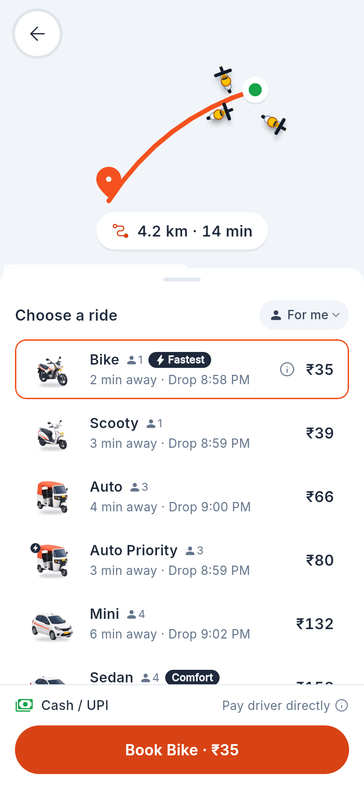
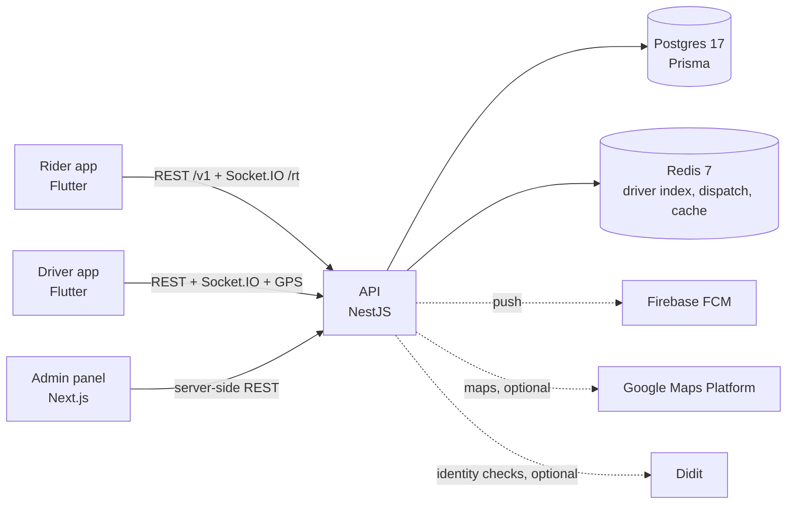

# Tamil Taxi

**Open-source ride-hailing and parcel delivery: 0% commission and no subscription for drivers.**

Tamil Taxi is a full ride-hailing platform built for Coimbatore, India. It has a rider app, a driver app, a backend and an
admin panel. Drivers keep the whole fare. There is no commission and no fee, and the running costs are paid by the
project. The code is open so that anyone can check it, improve it, or run it in their own city.

[](https://github.com/sivakrishnacode/tamiltaxi/actions/workflows/ci.yml)
[](LICENSE)
[](CONTRIBUTING.md)

| Choose a vehicle | Ride in progress | Driver: incoming request | Driver: earnings |
|---|---|---|---|
|  |  |  |  |

<sub>Screens from the apps, in <a href="docs/design/index.md">docs/design</a> (refreshed with <code>scripts/export_design.py</code>).</sub>

## What's in it

**Rider app (Flutter, Android)**
- Book bike taxi, auto and cab rides; send parcels on goods bikes and trucks
- Fare quotes with a transparent breakdown, and live driver tracking
- Trip share links, SOS, "Did you reach safely?" checks after night rides
- Butterfly: ask for a woman driver

**Driver app (Flutter, Android)**
- Go online and see demand hotspots on an H3 hex map
- Accept rides by swiping; requests are read aloud in English or Tamil; up to 3 requests at once
- A floating bubble keeps requests coming while other apps are open
- Booking preferences: going home, pickup distance, trip length
- Earnings screen, and identity checks at sign-up

**Backend (NestJS, Postgres, Redis, Socket.IO)**
- Dispatch on Uber's [H3](https://h3geo.org) grid: rings outward from the pickup, ranked by road ETA and each
  driver's offer record
- Demand-based surge (off by default), learned ETAs, and one fare engine shared with the apps
- Guarded trip state machine, GPS breadcrumbs, route-deviation and stop checks, cancellation fault rules
- FCM push notifications, Google Maps with an aggressive cache (plus an offline fallback), Didit identity checks

**Website (Next.js 16, static)**
- Home page for riders and drivers, plus the privacy policy, terms and account deletion pages Google Play asks for
- Builds to plain HTML in `apps/web/out/`, so it can be hosted anywhere for free

**Admin panel (Next.js 16, shadcn/ui)**
- Live map, heatmaps and a zone editor
- KYC queue, trips, drivers, riders, SOS handling
- Settings for pricing, dispatch, safety, driver plans and support

## Architecture



It all runs with Docker Compose on one small server (today one AWS t3.small). See
[docs/COST_AND_SCALING.md](docs/COST_AND_SCALING.md) for what that costs and how it scales.

## Quick start

You need **Node 24**, **Docker** and, for the apps, **Flutter stable** with an Android emulator or phone.

### 1. Backend and admin (Docker)

```bash
git clone https://github.com/sivakrishnacode/tamiltaxi.git && cd tamiltaxi
cp .env.example .env
docker compose up -d                 # Postgres, Redis, API on :3000, admin on :3001
curl localhost:3000/health/ready
```

Open http://localhost:3001 and sign in with phone **9000000001** and OTP **123456**.

### 2. The apps

```bash
npm install && npm run get           # JS deps, flutter pub get everywhere, prisma generate

# Against your local API (the Android emulator reaches your PC at 10.0.2.2)
cd apps/passenger && sh ../../scripts/flutter.sh run --dart-define=TT_API_URL=http://10.0.2.2:3000/v1

# Or with no backend at all: seed data and simulated trips
cd apps/driver && sh ../../scripts/flutter.sh run --dart-define=TT_LIVE_API=false
```

Demo codes:

| What | Code |
|---|---|
| Sign-in OTP | `123456` (with `npm run start:dev`, any 6 digits except `000000`) |
| Ride OTP | `4829` |
| Delivery OTP | `7153` |

`npm run seed:test-drivers -w @tamiltaxi/api` adds 11 approved drivers to sign in as. Run it after
`cp apps/api/.env.example apps/api/.env`, so the seeder can reach the Docker Postgres.

In both apps, **Account › Design gallery** opens any screen on its own. Its **Demo controls** force states such as
no drivers, a driver who cancels, offline or GPS lost. The row is hidden in normal builds; add
`--dart-define=TT_DESIGN_GALLERY=true` to `flutter run` to show it.

Maps work without any keys: CARTO tiles, seeded places and straight-line distances. For Google Maps, see
[docs/GOOGLE_MAPS_SETUP.md](docs/GOOGLE_MAPS_SETUP.md).

## Repository layout

```
apps/
  api/          NestJS 12 + Prisma 7 + Redis + Socket.IO          @tamiltaxi/api
  admin/        Next.js 16 admin panel, port 3001                 @tamiltaxi/admin
  web/          Public website, static Next.js export, port 3002  @tamiltaxi/web
  passenger/    Flutter rider app "Tamil Taxi" (com.tamiltaxi.passenger)     @tamiltaxi/passenger
  driver/       Flutter driver app "Tamil Taxi Driver" (com.tamiltaxi.driver)@tamiltaxi/driver
packages/
  tamiltaxi_ui/      design system: theme, widgets, map, illustrations @tamiltaxi/ui
  tamiltaxi_data/    models, fare engine, API client, mock repos, simulator  @tamiltaxi/data
  flutter_overlay_window/  vendored plugin (MIT) for the driver's floating bubble
docs/
  tech-docs/using.tech.md  full technical reference
  COST_AND_SCALING.md      running cost and scaling plan
  GOOGLE_MAPS_SETUP.md     Google Maps keys
  design/                  design frames (PNG) + index
scripts/        Flutter SDK lookup, APK build
caddy/          HTTPS reverse proxy config (compose profile "https")
```

This is a Turborepo + npm workspaces monorepo. Each Flutter package has a small `package.json`, so Turborepo runs
the Flutter tasks in dependency order and caches them.

| Command | What it does |
|---|---|
| `npm run check` | Analyze and test everything (CI runs this) |
| `npx turbo run analyze test --filter=@tamiltaxi/driver` | One package only |
| `npm run test:e2e -w @tamiltaxi/api` | Full ride lifecycle against a real Postgres and Redis |
| `npm run start:dev -w @tamiltaxi/api` | API with hot reload (databases: `docker compose up -d postgres redis`) |
| `npm run dev -w @tamiltaxi/admin` | Admin panel with hot reload |
| `npm run dev -w @tamiltaxi/web` | Website with hot reload; `npm run build -w @tamiltaxi/web` writes the static site to `apps/web/out/` |
| `./scripts/build_apks.sh` | Release APKs → `dist/` |

## Documentation

| Doc | For |
|---|---|
| [CONTRIBUTING.md](CONTRIBUTING.md) | Setting up, making a change, checks, commit style |
| [docs/tech-docs/using.tech.md](docs/tech-docs/using.tech.md) | Every module, endpoint, env var, Redis key, algorithm and deployment step |
| [docs/COST_AND_SCALING.md](docs/COST_AND_SCALING.md) | What it costs per trip, the free tiers, the plan to self-host maps |
| [docs/GOOGLE_MAPS_SETUP.md](docs/GOOGLE_MAPS_SETUP.md) | Creating and restricting the Google Maps keys |
| [docs/design/index.md](docs/design/index.md) | Every app screen, by frame ID |
| [apps/api/README.md](apps/api/README.md), [apps/admin/AGENTS.md](apps/admin/AGENTS.md) | Per-app notes |

## Status

Pre-launch. The apps, API and admin are feature-complete for a pilot and run on a staging server with test data.

Still to do before a public launch:
- a real domain
- an SMS provider for OTPs
- automated backups
- a real-phone test pass

The full list is in [using.tech.md §10](docs/tech-docs/using.tech.md#10-not-done-yet--next-steps).

## Contributing

Contributions are welcome: code, testing on real phones, design, translations (Tamil first), docs and OpenStreetMap
fixes. Start with [CONTRIBUTING.md](CONTRIBUTING.md), and look for issues labelled `good first issue`.

Please report security issues privately (see [SECURITY.md](SECURITY.md)). This project follows the
[Contributor Covenant](CODE_OF_CONDUCT.md).

## License

[GNU AGPL-3.0](LICENSE). You can use, change and run Tamil Taxi, including as a service. If you run a modified version
for other people, you must publish your changes under the same license. The vendored
`packages/flutter_overlay_window` is MIT (see its [LICENSE](packages/flutter_overlay_window/LICENSE)).
